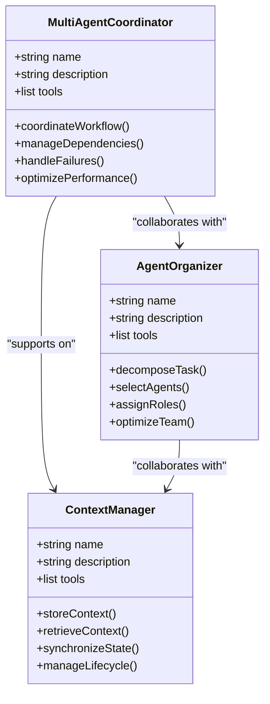
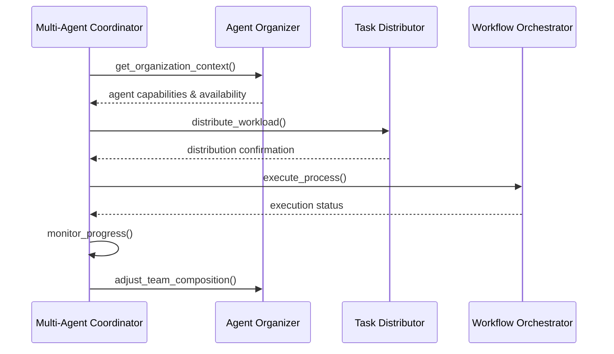
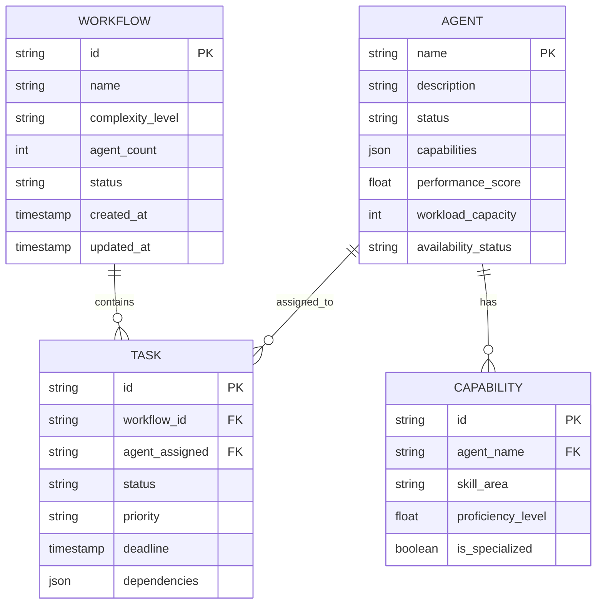

# Multi-Agent Coordinator

<cite>
**Referenced Files in This Document**   
- [multi-agent-coordinator.md](file://multi-agent-coordinator.md)
- [agent-organizer.md](file://agent-organizer.md)
- [context-manager.md](file://context-manager.md)
- [workflow-orchestrator.md](file://workflow-orchestrator.md)
- [task-distributor.md](file://task-distributor.md)
</cite>

## Table of Contents
1. [Introduction](#introduction)
2. [Core Responsibilities](#core-responsibilities)
3. [Agent Selection and Team Assembly](#agent-selection-and-team-assembly)
4. [Task Delegation and Workflow Orchestration](#task-delegation-and-workflow-orchestrator)
5. [Inter-Agent Communication Framework](#inter-agent-communication-framework)
6. [Decision-Making Logic and Capability Matching](#decision-making-logic-and-capability-matching)
7. [Domain Model for Agent Coordination](#domain-model-for-agent-coordination)
8. [Coordination Patterns and Execution Models](#coordination-patterns-and-execution-models)
9. [Fullstack Development Workflow Example](#fullstack-development-workflow-example)
10. [Fault Tolerance and Conflict Resolution](#fault-tolerance-and-conflict-resolution)
11. [Performance and Scalability](#performance-and-scalability)
12. [Integration with Supporting Agents](#integration-with-supporting-agents)
13. [Best Practices and Optimization](#best-practices-and-optimization)

## Introduction

The Multi-Agent Coordinator serves as the central orchestrator in a distributed AI agent ecosystem, responsible for enabling seamless collaboration across specialized subagents. This document details its architecture, decision-making processes, and operational patterns that enable efficient coordination at scale. The coordinator ensures optimal workflow execution by leveraging sophisticated agent selection, task delegation, and communication protocols while maintaining fault tolerance and performance efficiency across complex multi-agent workflows.

**Section sources**
- [multi-agent-coordinator.md](file://multi-agent-coordinator.md#L1-L20)

## Core Responsibilities

The Multi-Agent Coordinator manages the end-to-end lifecycle of distributed agent workflows through four primary functions: workflow analysis, execution control, state monitoring, and result aggregation. It initiates coordination by querying the Context Manager for workflow requirements and agent states, then systematically evaluates communication patterns, dependencies, and resource constraints. The coordinator maintains strict performance benchmarks including less than 5% coordination overhead, 100% deadlock prevention, and guaranteed message delivery across all agent interactions.

Key operational domains include workflow orchestration (process design, state management, checkpoint handling), inter-agent communication (protocol design, message routing, queue management), and dependency resolution (topological sorting, circular dependency detection, priority scheduling). The system supports scalability to over 100 agents while ensuring fault tolerance through automated recovery procedures and comprehensive monitoring.

**Section sources**
- [multi-agent-coordinator.md](file://multi-agent-coordinator.md#L21-L43)
- [multi-agent-coordinator.md](file://multi-agent-coordinator.md#L44-L97)

## Agent Selection and Team Assembly

Agent selection is performed in collaboration with the Agent Organizer, which provides capability mapping and team composition services. The coordinator evaluates agents based on capability matching, performance history, availability status, and workload capacity. The Agent Organizer decomposes tasks, identifies subtasks, maps dependencies, and estimates complexity before recommending optimal agent teams.

The team assembly process follows a capability-based selection pattern with redundancy planning, ensuring skill coverage across all required domains. Compatibility matrices verify agent interoperability while workload balancing prevents resource starvation. The integration between Multi-Agent Coordinator and Agent Organizer enables dynamic team reconfiguration in response to changing workflow requirements or agent availability.

**Diagram sources**
- [multi-agent-coordinator.md](file://multi-agent-coordinator.md#L282-L283)
- [agent-organizer.md](file://agent-organizer.md#L282-L283)

**Section sources**
- [multi-agent-coordinator.md](file://multi-agent-coordinator.md#L282-L283)
- [agent-organizer.md](file://agent-organizer.md#L1-L20)

## Task Delegation and Workflow Orchestration

Task delegation follows a structured development workflow beginning with workflow analysis, where the coordinator maps processes, identifies dependencies, analyzes communication needs, and assesses parallelism opportunities. During implementation, it configures workflows, manages dependencies, controls execution flow, and monitors progress through standardized tracking metrics.

The coordinator leverages multiple orchestration patterns including master-worker, hierarchical, and publish-subscribe models. It implements fork-join patterns for parallel execution, scatter-gather for distributed processing, and pipeline workflows for sequential task chains. Workflow completion is tracked through progress metrics including active agents, messages processed per minute, workflow completion percentage, and coordination efficiency.

**Diagram sources**
- [multi-agent-coordinator.md](file://multi-agent-coordinator.md#L132-L199)
- [agent-organizer.md](file://agent-organizer.md#L146-L181)

**Section sources**
- [multi-agent-coordinator.md](file://multi-agent-coordinator.md#L132-L199)
- [agent-organizer.md](file://agent-organizer.md#L146-L181)

## Inter-Agent Communication Framework

The coordinator establishes a robust communication infrastructure using multiple mechanisms including message passing, event streams, RPC calls, and queue systems. It implements publish-subscribe patterns for event distribution, request-reply patterns for synchronous communication, and broadcast strategies for system-wide notifications. The message-queue tool enables asynchronous messaging with backpressure handling to prevent system overload.

Communication optimization techniques include message batching, compression strategies, route optimization, and connection pooling. The coordinator ensures 99.9% message delivery guarantee through retry mechanisms, circuit breakers, and fallback strategies. Real-time monitoring tracks messages processed per minute (up to 234K/min in production scenarios) and maintains coordination efficiency above 96%.

**Section sources**
- [multi-agent-coordinator.md](file://multi-agent-coordinator.md#L81-L97)
- [multi-agent-coordinator.md](file://multi-agent-coordinator.md#L241-L248)

## Decision-Making Logic and Capability Matching

The decision-making engine evaluates agent capabilities through queries to the Agent Registry via the Agent Organizer. It analyzes workflow complexity, agent count requirements, communication patterns, performance targets, and fault tolerance needs before making delegation decisions. The capability matching process considers specialization areas, historical success rates, current workload, and compatibility factors.

Priority scheduling algorithms allocate tasks based on urgency, deadlines, and SLA requirements while preventing starvation through fair scheduling policies. Resource allocation considers both immediate needs and long-term utilization patterns. The system employs constraint solving and critical path analysis to optimize task sequencing and dependency resolution.

**Section sources**
- [multi-agent-coordinator.md](file://multi-agent-coordinator.md#L132-L139)
- [agent-organizer.md](file://agent-organizer.md#L1-L20)

## Domain Model for Agent Coordination

The domain model consists of four core components: Agent Metadata, Capability Registry, Workflow Definitions, and Coordination Protocols. Agent Metadata includes name, description, tools, capabilities, availability status, and performance metrics. The Capability Registry maintains skill inventories, specialization areas, and compatibility matrices.

Workflow Definitions specify process models, state transitions, dependency graphs, and error handling paths. Coordination Protocols define handoff procedures, communication channels, synchronization points, and result aggregation methods. State synchronization with the Context Manager ensures consistency across distributed components using version control and conflict resolution strategies.

**Diagram sources**
- [multi-agent-coordinator.md](file://multi-agent-coordinator.md#L1-L292)
- [agent-organizer.md](file://agent-organizer.md#L1-L292)

**Section sources**
- [multi-agent-coordinator.md](file://multi-agent-coordinator.md#L1-L292)
- [agent-organizer.md](file://agent-organizer.md#L1-L292)

## Coordination Patterns and Execution Models

The coordinator implements eight primary coordination patterns: master-worker for centralized control, peer-to-peer for decentralized collaboration, hierarchical for layered decision-making, and publish-subscribe for event-driven communication. Pipeline patterns enable sequential processing while scatter-gather supports parallel task distribution and aggregation.

Execution models include map-reduce workflows for data processing, barrier coordination for synchronization points, and consensus-based patterns for distributed decision-making. The system handles complex scenarios through compensation logic, rollback procedures, and saga patterns that maintain consistency across distributed transactions.

**Section sources**
- [multi-agent-coordinator.md](file://multi-agent-coordinator.md#L61-L68)

## Fullstack Development Workflow Example

In a fullstack development scenario, the coordinator orchestrates frontend, backend, and DevOps agents through a coordinated workflow. The process begins with the Agent Organizer assembling a team comprising Frontend Developer, Backend Developer, and DevOps Engineer based on project requirements.

The coordinator establishes communication channels using message queues and pubsub systems. It delegates UI implementation to the Frontend Developer, API development to the Backend Developer, and deployment configuration to the DevOps Engineer. Dependencies are managed through the workflow engine, ensuring the API is completed before integration testing begins.

State synchronization occurs through the Context Manager, which maintains shared knowledge about component interfaces and data schemas. The Task Distributor allocates subtasks within each domain, while the Workflow Orchestrator manages the overall process flow, including testing, deployment, and monitoring phases.

**Section sources**
- [multi-agent-coordinator.md](file://multi-agent-coordinator.md#L132-L270)
- [workflow-orchestrator.md](file://workflow-orchestrator.md#L1-L292)

## Fault Tolerance and Conflict Resolution

The coordinator implements comprehensive fault tolerance through failure detection, isolation strategies, and automated recovery procedures. It handles agent conflicts through priority-based resolution, capability verification, and backup agent activation. Capability mismatches are addressed through real-time capability verification and agent substitution protocols.

Coordination loops are prevented through timeout handling, circuit breakers, and state restoration mechanisms. The Error Coordinator assists with failure handling, implementing retry policies, fallback strategies, and graceful degradation when primary agents fail. Deadlock prevention is ensured through resource locking protocols and circular dependency detection.

**Section sources**
- [multi-agent-coordinator.md](file://multi-agent-coordinator.md#L92-L97)
- [error-coordinator.md](file://error-coordinator.md#L281-L282)

## Performance and Scalability

The system achieves high performance through bottleneck analysis, pipeline optimization, and batch processing. It maintains coordination efficiency above 96% while processing up to 234K messages per minute across 87 active agents. Scalability patterns include horizontal scaling, vertical partitioning, load distribution, and cluster coordination.

Performance metrics are continuously monitored, including coordination overhead (<5%), message delivery rates (99.9%), and workflow completion rates (94%). The system optimizes resource utilization through connection management, resource pooling, and efficient caching strategies. Latency is minimized through protocol efficiency improvements and async communication patterns.

**Section sources**
- [multi-agent-coordinator.md](file://multi-agent-coordinator.md#L201-L220)
- [multi-agent-coordinator.md](file://multi-agent-coordinator.md#L258-L265)

## Integration with Supporting Agents

The coordinator maintains critical integrations with seven supporting agents to ensure comprehensive workflow management. It collaborates with the Agent Organizer for team assembly, supports the Context Manager on state synchronization, and works with the Workflow Orchestrator on process execution. The Task Distributor receives guidance on work allocation, while the Performance Monitor collects metrics for optimization.

The Error Coordinator receives assistance with failure handling, and the Knowledge Synthesizer partners on pattern recognition and optimization. These integrations create a cohesive ecosystem where each agent contributes specialized capabilities to the overall coordination process, enabling seamless collaboration at scale.

**Section sources**
- [multi-agent-coordinator.md](file://multi-agent-coordinator.md#L282-L289)
- [task-distributor.md](file://task-distributor.md#L282-L283)

## Best Practices and Optimization

Optimal coordination is achieved through continuous optimization of communication protocols, dependency resolution, and resource allocation. Best practices include maintaining clear dependencies, implementing efficient messaging patterns, and ensuring fault tolerance through automated recovery. The system prioritizes parallel execution where possible and implements barrier coordination for synchronization points.

Monitoring is comprehensive and continuous, with real-time tracking of active agents, message throughput, and workflow completion rates. The coordinator validates its approach through systematic evaluation of processes, dependencies, communication patterns, and recovery procedures before full implementation. This ensures reliable, scalable, and efficient multi-agent collaboration across complex workflows.

**Section sources**
- [multi-agent-coordinator.md](file://multi-agent-coordinator.md#L178-L185)
- [multi-agent-coordinator.md](file://multi-agent-coordinator.md#L221-L240)