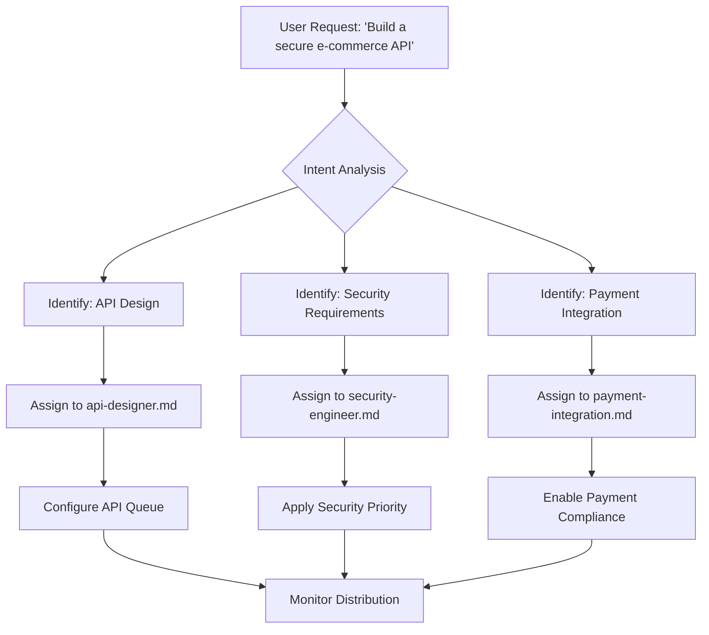

# Task Distributor

<cite>
**Referenced Files in This Document**   
- [task-distributor.md](file://task-distributor.md)
- [api-designer.md](file://api-designer.md)
- [security-engineer.md](file://security-engineer.md)
- [payment-integration.md](file://payment-integration.md)
- [context-manager.md](file://context-manager.md)
</cite>

## Table of Contents
1. [Introduction](#introduction)
2. [Core Responsibilities](#core-responsibilities)
3. [Task Decomposition Workflow](#task-decomposition-workflow)
4. [Domain Model](#domain-model)
5. [Parsing Logic and Intent Analysis](#parsing-logic-and-intent-analysis)
6. [Agent Assignment Strategy](#agent-assignment-strategy)
7. [Load Balancing and Scheduling](#load-balancing-and-scheduling)
8. [Common Issues and Solutions](#common-issues-and-solutions)
9. [Integration with Agent Ecosystem](#integration-with-agent-ecosystem)
10. [Performance Metrics and Optimization](#performance-metrics-and-optimization)

## Introduction

The **task-distributor.md** agent serves as the central orchestrator for intelligent work allocation within the multi-agent system. It specializes in breaking down complex user requests into discrete, actionable tasks and assigning them to the most appropriate specialized agents based on capability, workload, and priority. This document details its architecture, operational workflow, and integration patterns across the agent ecosystem.

The task distributor ensures optimal system throughput by implementing advanced load balancing, priority scheduling, and capacity tracking mechanisms. It plays a critical role in maintaining fairness, efficiency, and reliability while distributing work across diverse agents such as api-designer.md, security-engineer.md, and payment-integration.md.

**Section sources**
- [task-distributor.md](file://task-distributor.md#L0-L43)

## Core Responsibilities

The task distributor performs three primary functions: task decomposition, agent assignment, and workload optimization. It ensures that high-level user requests are systematically broken down into granular subtasks, each mapped to agents with matching expertise.

Key responsibilities include:
- Analyzing incoming requests for scope, complexity, and dependencies
- Identifying required agent capabilities and specialization domains
- Prioritizing tasks based on deadlines, SLAs, and business impact
- Monitoring agent workloads and availability status
- Preventing task duplication and resource contention
- Ensuring queue health and preventing overflow

The agent operates under strict performance targets, including distribution latency under 50ms, load balance variance below 10%, and task completion rates exceeding 99%.

**Section sources**
- [task-distributor.md](file://task-distributor.md#L0-L43)
- [task-distributor.md](file://task-distributor.md#L45-L97)

## Task Decomposition Workflow

The task distributor follows a structured three-phase development workflow to ensure systematic and reliable task allocation.

### 1. Workload Analysis

Before distribution, the agent conducts comprehensive workload analysis by querying the context-manager.md for relevant information. It evaluates task volumes, agent capacities, priority schemes, and performance constraints.

Analysis priorities include:
- Task profiling and volume assessment
- Priority and deadline mapping
- Resource requirement identification
- Capacity evaluation across agents
- Pattern recognition in historical workloads

This phase enables the creation of optimized distribution plans and queue designs.

### 2. Implementation Phase

During implementation, the task distributor configures task queues, sets up routing rules, and implements load balancing strategies. It tracks agent capacities in real time and monitors distribution metrics continuously.

Key implementation activities:
- Queue configuration with priority levels
- Routing rule setup based on agent skills
- Load balancer initialization
- Exception handling and fallback routing
- Performance measurement and adjustment

Progress is tracked via structured JSON payloads showing metrics like tasks distributed, average queue time, and deadline success rates.

### 3. Distribution Excellence

In the final phase, the agent verifies that all excellence criteria are met, including efficient distribution, balanced loads, maintained priorities, and optimized resource usage.

Excellence verification includes:
- Confirming queue health and monitoring status
- Validating SLA compliance
- Ensuring no bottlenecks exist
- Optimizing throughput and response times

Upon completion, a delivery notification is generated summarizing performance outcomes.

**Section sources**
- [task-distributor.md](file://task-distributor.md#L132-L217)
- [task-distributor.md](file://task-distributor.md#L219-L280)

## Domain Model

The task distributor operates on a well-defined domain model encompassing task queues, priority levels, and assignment rules.

### Task Queues

Task queues are managed using a sophisticated architecture supporting:
- Priority levels for differentiated processing
- Message ordering guarantees
- Time-to-live (TTL) handling
- Dead letter queues for failed tasks
- Retry mechanisms with exponential backoff
- Batch processing capabilities
- Real-time monitoring and alerting

Queues are designed to prevent overflow and ensure smooth flow even during peak loads.

### Priority Levels

Priority scheduling incorporates multiple dimensions:
- Priority schemes (high, medium, low, emergency)
- Deadline management with SLA enforcement
- Preemption rules for urgent tasks
- Starvation prevention mechanisms
- Resource reservation for critical operations
- Fair scheduling across competing agents

This ensures high-priority tasks are processed promptly without completely starving lower-priority work.

### Assignment Rules

Task routing follows intelligent matching algorithms based on:
- Agent skill mapping and capability matching
- Current workload and availability status
- Historical performance and efficiency scores
- Cost factors and resource utilization
- Affinity routing for related tasks
- Fallback strategies for unavailable agents

Rules support manual overrides and automatic escalation paths when needed.

**Section sources**
- [task-distributor.md](file://task-distributor.md#L45-L97)
- [task-distributor.md](file://task-distributor.md#L219-L280)

## Parsing Logic and Intent Analysis

The task distributor employs advanced parsing logic to analyze user intent and extract requirements from natural language requests.

When a request like "build a secure e-commerce API" is received, the agent performs semantic analysis to identify key components:
- "build" → indicates creation task
- "secure" → implies security requirements
- "e-commerce" → suggests payment integration needs
- "API" → points to interface design

Based on this analysis, it decomposes the request into subtasks:
- API design → assigned to api-designer.md
- Security implementation → assigned to security-engineer.md
- Payment integration → assigned to payment-integration.md

The agent queries context-manager.md for additional context about existing patterns, compliance needs, and integration points before finalizing assignments.



**Diagram sources**
- [task-distributor.md](file://task-distributor.md#L132-L217)
- [api-designer.md](file://api-designer.md#L0-L43)
- [security-engineer.md](file://security-engineer.md#L0-L43)
- [payment-integration.md](file://payment-integration.md#L0-L43)

**Section sources**
- [task-distributor.md](file://task-distributor.md#L132-L217)
- [api-designer.md](file://api-designer.md#L0-L43)
- [security-engineer.md](file://security-engineer.md#L0-L43)
- [payment-integration.md](file://payment-integration.md#L0-L43)

## Agent Assignment Strategy

The task distributor uses a multi-factor approach to assign tasks to specialized agents.

### Skill Mapping

Each agent has defined capabilities documented in their profile (e.g., api-designer.md specializes in REST/GraphQL design). The distributor maintains a skill registry and matches tasks to agents based on expertise.

For example:
- API design → api-designer.md
- Security implementation → security-engineer.md
- Payment processing → payment-integration.md
- Database optimization → database-optimizer.md

### Workload-Based Distribution

The agent considers current workloads before assignment:
- Monitors active tasks per agent
- Tracks performance metrics and completion rates
- Evaluates resource usage and efficiency scores
- Applies capacity-based distribution

This prevents overloading high-performing agents and maintains balanced utilization.

### Fallback and Escalation

When primary agents are unavailable:
- Fallback chains route tasks to secondary agents
- Emergency routing handles critical issues
- Manual override options exist for exceptional cases
- Automatic escalation occurs based on priority

This ensures continuity even when preferred agents are busy or offline.

**Section sources**
- [task-distributor.md](file://task-distributor.md#L45-L97)
- [task-distributor.md](file://task-distributor.md#L219-L280)

## Load Balancing and Scheduling

The task distributor implements sophisticated load balancing and scheduling algorithms to optimize system performance.

### Distribution Strategies

Multiple strategies are available and selected based on context:
- **Round-robin**: For uniform task types
- **Weighted distribution**: Based on agent capacity
- **Least connections**: Assigns to least busy agent
- **Random selection**: For stateless tasks
- **Consistent hashing**: For affinity routing
- **Capacity-based**: Uses real-time utilization data
- **Performance-based**: Leverages historical metrics

### Dynamic Adjustment

The system continuously monitors:
- Queue states and processing times
- Agent workloads and response latencies
- Failure rates and retry patterns
- Resource utilization percentages

Based on this data, it dynamically adjusts weights, reroutes traffic, and scales resources as needed.

### Scheduling Algorithms

Priority scheduling ensures:
- High-priority tasks jump queues when necessary
- Deadlines are respected with >95% success rate
- Starvation is prevented through fair scheduling
- Emergency tasks receive immediate attention
- Resource reservations protect critical operations

These algorithms work in concert with the scheduler tool to maintain optimal throughput.

**Section sources**
- [task-distributor.md](file://task-distributor.md#L45-L97)
- [task-distributor.md](file://task-distributor.md#L219-L280)

## Common Issues and Solutions

The task distributor proactively addresses common distribution challenges.

### Task Duplication

**Issue**: Same task assigned multiple times due to race conditions or failed acknowledgments.

**Solution**: 
- Implements idempotency keys for tasks
- Uses distributed locking via redis
- Maintains task registry in context-manager.md
- Applies deduplication filters before assignment

### Improper Scoping

**Issue**: Tasks too broad or too narrow, leading to inefficiencies.

**Solution**:
- Applies task profiling during workload analysis
- Breaks down large tasks using domain knowledge
- Combines micro-tasks when beneficial
- Validates scope with context-manager.md

### Resource Contention

**Issue**: Multiple agents competing for same resources.

**Solution**:
- Implements resource pooling and quota management
- Uses affinity routing to group related tasks
- Applies transactional semantics for critical sections
- Coordinates through agent-organizer.md for capacity planning

### Queue Overflow

**Issue**: Backlog grows faster than processing rate.

**Solution**:
- Monitors queue depth in real time
- Scales agent pool through elastic scaling
- Implements priority-based draining
- Routes overflow to dead letter queues with alerts

**Section sources**
- [task-distributor.md](file://task-distributor.md#L0-L43)
- [task-distributor.md](file://task-distributor.md#L219-L280)

## Integration with Agent Ecosystem

The task distributor collaborates extensively with other agents to maintain system-wide coherence.

### Key Integrations

- **context-manager.md**: Retrieves task requirements, agent capacities, and system state
- **agent-organizer.md**: Coordinates on capacity planning and team composition
- **workflow-orchestrator.md**: Aligns on task dependencies and execution sequences
- **performance-monitor.md**: Shares distribution metrics and receives performance feedback
- **error-coordinator.md**: Handles retry distribution and failure recovery
- **knowledge-synthesizer.md**: Learns from historical patterns and improves routing

### Communication Protocol

The agent uses standardized JSON messages for context queries:

```json
{
  "requesting_agent": "task-distributor",
  "request_type": "get_distribution_context",
  "payload": {
    "query": "Distribution context needed: task volumes, agent capacities, priority schemes, performance targets, and constraint requirements."
  }
}
```

This ensures consistent information exchange across the ecosystem.

**Section sources**
- [task-distributor.md](file://task-distributor.md#L132-L217)
- [context-manager.md](file://context-manager.md#L0-L43)

## Performance Metrics and Optimization

The task distributor is evaluated against rigorous performance benchmarks.

### Key Metrics

| Metric | Target | Measurement Method |
|-------|--------|-------------------|
| Distribution Latency | < 50ms | End-to-end timing |
| Load Balance Variance | < 10% | Standard deviation across agents |
| Task Completion Rate | > 99% | Success/failure tracking |
| Deadline Success | > 95% | Due date compliance |
| Resource Utilization | > 80% | Capacity monitoring |
| Queue Overflow | Prevented | Depth monitoring |

### Optimization Techniques

- **Dynamic Rebalancing**: Adjusts distribution weights in real time
- **Predictive Routing**: Uses historical data to anticipate needs
- **Bottleneck Detection**: Identifies and resolves performance constraints
- **Throughput Optimization**: Maximizes tasks processed per second
- **Latency Minimization**: Reduces end-to-end processing time
- **Cost Optimization**: Balances performance with resource costs

Progress is continuously reported via structured payloads showing metrics like tasks distributed, average queue time, and deadline success rates.

Delivery notifications summarize achievements, such as: "Distributed 45K tasks with 230ms average queue time and 7% load variance. Achieved 97% deadline success rate with 84% resource utilization."

**Section sources**
- [task-distributor.md](file://task-distributor.md#L0-L43)
- [task-distributor.md](file://task-distributor.md#L219-L280)