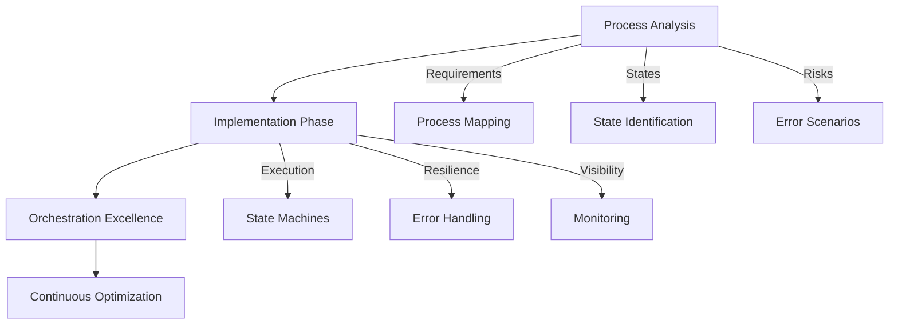
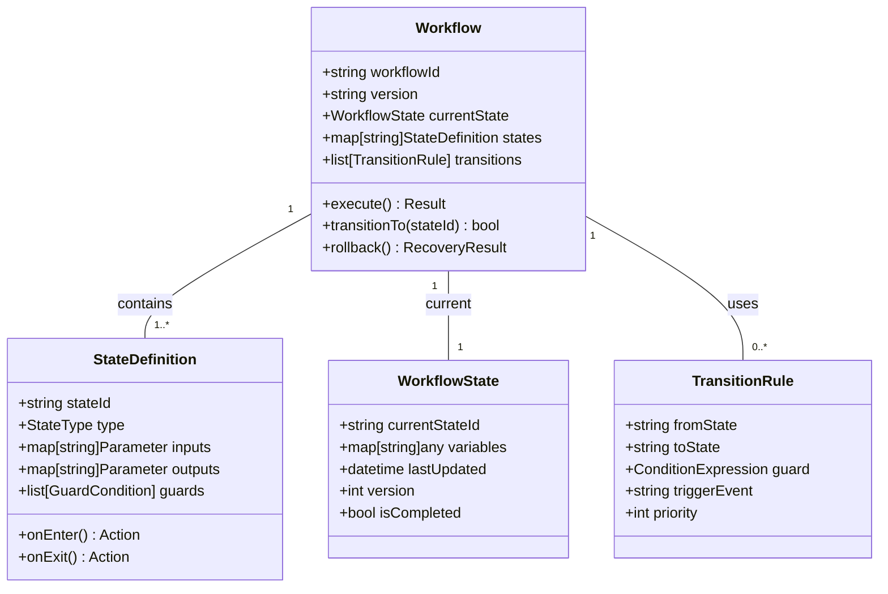
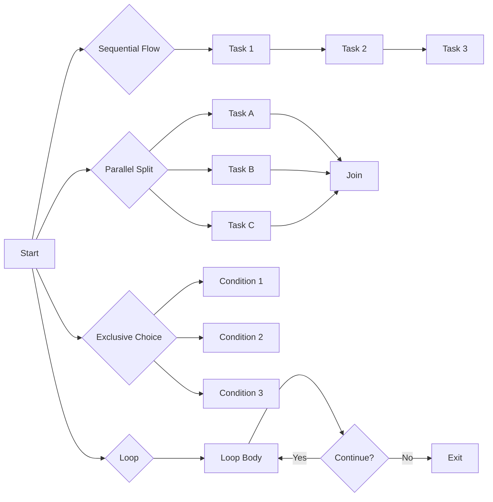
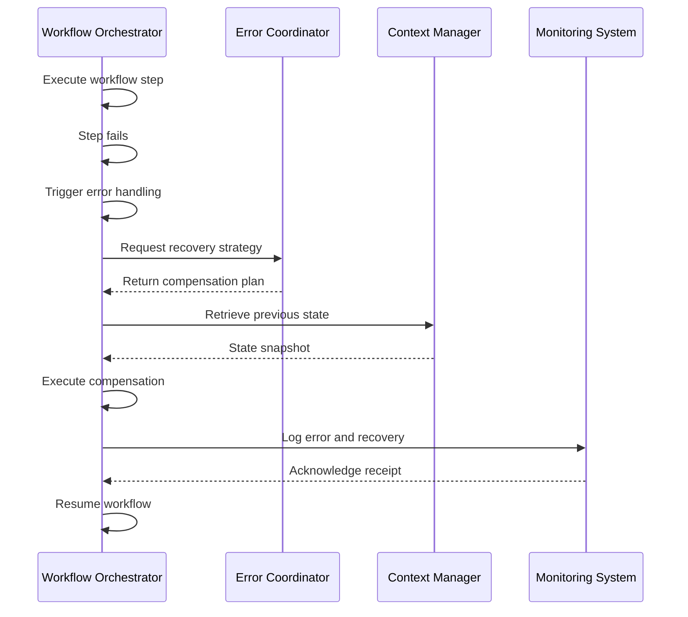
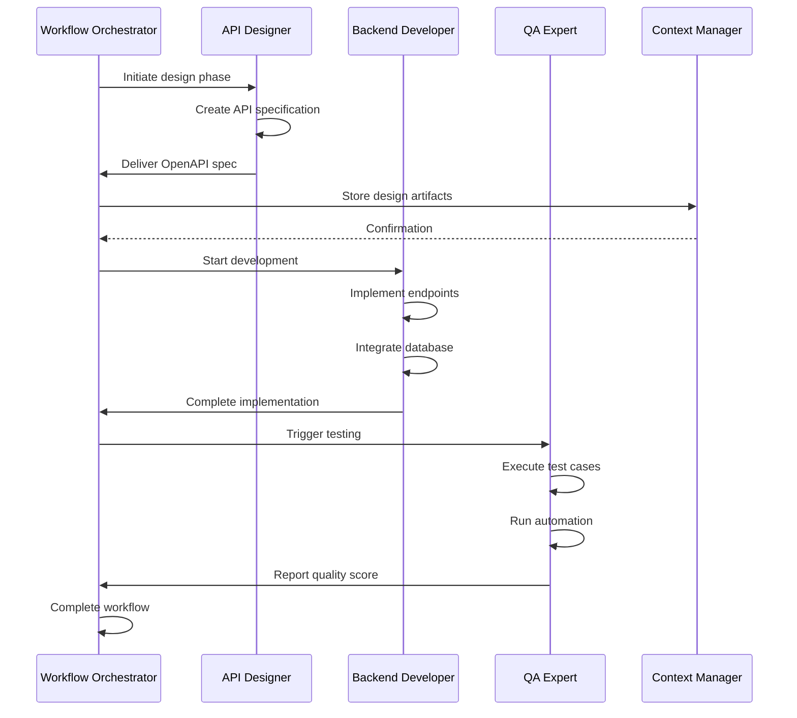
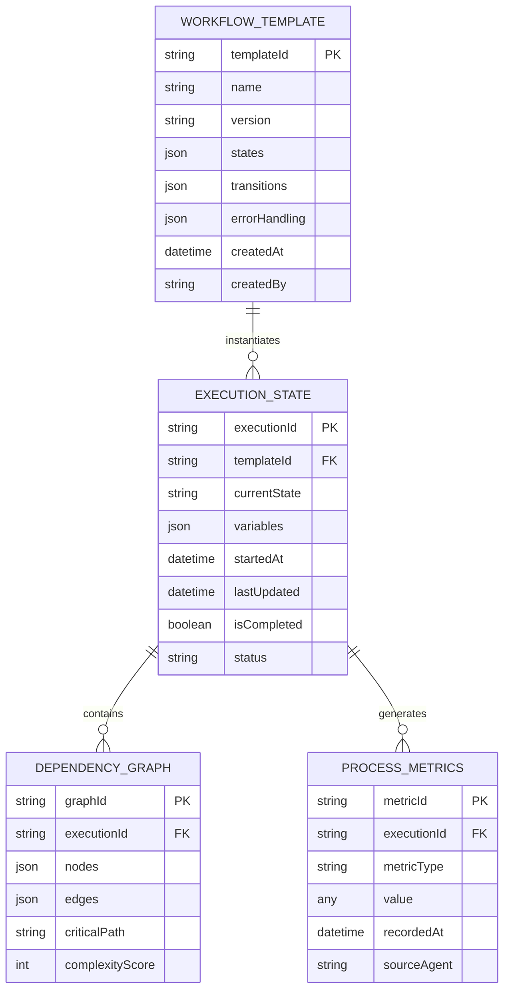
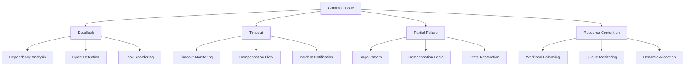
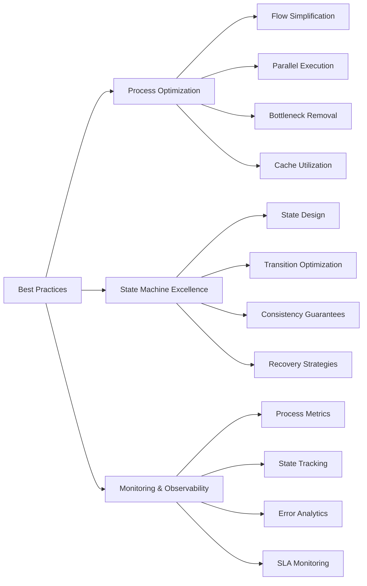

# Workflow Orchestrator

<cite>
**Referenced Files in This Document**   
- [workflow-orchestrator.md](file://workflow-orchestrator.md)
- [performance-monitor.md](file://performance-monitor.md)
- [api-designer.md](file://api-designer.md)
- [backend-developer.md](file://backend-developer.md)
- [qa-expert.md](file://qa-expert.md)
</cite>

## Table of Contents
1. [Introduction](#introduction)
2. [Core Functionality](#core-functionality)
3. [Workflow Definition and State Management](#workflow-definition-and-state-management)
4. [Execution Engine and Process Patterns](#execution-engine-and-process-patterns)
5. [Error Handling and Fault Tolerance](#error-handling-and-fault-tolerance)
6. [Integration with Performance Monitor](#integration-with-performance-monitor)
7. [Collaboration with Development Agents](#collaboration-with-development-agents)
8. [Domain Model for Workflows](#domain-model-for-workflows)
9. [Common Issues and Solutions](#common-issues-and-solutions)
10. [Best Practices and Optimization](#best-practices-and-optimization)

## Introduction
The Workflow Orchestrator is a specialized agent responsible for managing end-to-end development workflows by sequencing and monitoring multi-step processes. It enables structured execution of complex workflows such as "design → develop → test → deploy" through robust state management, fault-tolerant execution, and real-time progress tracking. Designed with reliability, flexibility, and observability in mind, the orchestrator ensures consistent workflow execution across distributed agent systems while maintaining full auditability and recovery capabilities.

The orchestrator operates using formal workflow definitions, state machines, and business process modeling (BPMN) principles to coordinate various specialized agents throughout the software development lifecycle. By integrating with monitoring, error handling, and context management systems, it provides comprehensive visibility into workflow execution and enables automated recovery from failures.

**Section sources**
- [workflow-orchestrator.md](file://workflow-orchestrator.md#L0-L43)

## Core Functionality
The Workflow Orchestrator manages the complete lifecycle of development workflows, from initiation to completion, ensuring that each phase executes in the correct sequence with proper dependencies and error handling. Its primary responsibilities include process modeling, state tracking, execution coordination, and performance monitoring.

Key operational metrics demonstrate high reliability and efficiency:
- Workflow reliability exceeding 99.9%
- State consistency maintained at 100%
- Recovery time under 30 seconds
- Average execution duration of 4.7 minutes
- 99.4% success rate across 1.2K executions per minute

The orchestrator follows a three-phase development workflow: Process Analysis, Implementation Phase, and Orchestration Excellence. During Process Analysis, it maps requirements, identifies states, and plans error handling. The Implementation Phase involves configuring state machines, setting up monitoring, and deploying workflows. Finally, Orchestration Excellence ensures all workflows are reliable, observable, and compliant.



**Diagram sources**
- [workflow-orchestrator.md](file://workflow-orchestrator.md#L138-L217)

**Section sources**
- [workflow-orchestrator.md](file://workflow-orchestrator.md#L138-L217)

## Workflow Definition and State Management
Workflow definitions are structured using BPMN (Business Process Model and Notation) standards and managed through a dedicated state-machine system. Each workflow consists of clearly defined states, transition rules, and decision logic that govern execution flow.

The orchestrator supports multiple process patterns including sequential flows, parallel splits/joins, exclusive choices, loops, event-based gateways, and time-based events. States are persisted reliably with version control, migration strategies, and audit logging to ensure consistency across executions.

State management features include:
- Persistent state storage with checkpoint/restart capability
- Transition validation and consistency checks
- Rollback support for failed operations
- Version migration for evolving workflows
- Audit trails for compliance and debugging

Workflows are defined with explicit entry points, decision nodes, and exit conditions, allowing for dynamic routing based on execution context and outcomes.



**Diagram sources**
- [workflow-orchestrator.md](file://workflow-orchestrator.md#L45-L96)

**Section sources**
- [workflow-orchestrator.md](file://workflow-orchestrator.md#L45-L96)

## Execution Engine and Process Patterns
The execution engine provides the runtime environment for workflow orchestration, supporting transactional integrity, dynamic modifications, and resource management. Built on the workflow-engine tool, it enables checkpointing, restart capabilities, and performance tuning to handle complex, long-running processes.

Supported process patterns include:
- **Sequential Flow**: Linear execution of tasks in defined order
- **Parallel Split/Join**: Concurrent execution of independent tasks
- **Exclusive Choice**: Conditional branching based on runtime data
- **Loops and Iterations**: Repeated execution until conditions met
- **Sub-processes**: Modular workflow components for reuse
- **Compensation**: Undo operations for failed transactions
- **Event-based Gateway**: Triggering actions based on external events
- **Time-based Events**: Scheduled or timeout-driven transitions

The engine supports dynamic workflow modifications during execution, version migration, and resource optimization to adapt to changing requirements without service interruption.



**Diagram sources**
- [workflow-orchestrator.md](file://workflow-orchestrator.md#L45-L96)

**Section sources**
- [workflow-orchestrator.md](file://workflow-orchestrator.md#L91-L128)

## Error Handling and Fault Tolerance
The orchestrator implements comprehensive error handling strategies to ensure fault-tolerant execution. It employs multiple techniques including retry strategies, compensation flows, fallback procedures, dead letter handling, timeout management, and circuit breaking.

For distributed transactions, the orchestrator uses Saga patterns with compensation logic to maintain consistency without requiring two-phase commit protocols. Each step in a transaction has a corresponding compensating action that can be executed if subsequent steps fail, enabling partial recovery while preserving data integrity.

Error handling features include:
- Automated retry with exponential backoff and jitter
- Circuit breaker patterns to prevent cascading failures
- Dead letter queues for unprocessable workflows
- Timeout management for long-running operations
- Rollback procedures for state restoration
- Partial recovery capabilities
- Comprehensive audit compliance

The system maintains an error budget and tracks mean time to recovery (MTTR), with automated recovery flows reducing manual intervention by 89%.



**Diagram sources**
- [workflow-orchestrator.md](file://workflow-orchestrator.md#L45-L96)
- [workflow-orchestrator.md](file://workflow-orchestrator.md#L219-L280)

**Section sources**
- [workflow-orchestrator.md](file://workflow-orchestrator.md#L45-L96)

## Integration with Performance Monitor
The Workflow Orchestrator collaborates closely with the Performance Monitor agent to provide real-time feedback on workflow execution. This integration enables continuous performance tracking, bottleneck detection, and optimization recommendations.

The orchestrator shares execution metrics including:
- Active workflow count
- Execution rate (executions per minute)
- Success rate percentage
- Average duration per workflow
- Resource utilization patterns
- Error frequency and types

Performance Monitor collects 2,847 metrics across 50 agents with sub-second latency, creating 23 dashboards that detect anomalies and identify bottlenecks. The integration reduces mean time to resolution (MTTR) by 65% and has identified optimizations saving $12,000 monthly in resource costs.

The orchestrator queries system architecture, performance SLAs, and current metrics from the Performance Monitor to optimize workflow execution based on real-time system conditions and capacity.

```mermaid
flowchart LR
A[Workflow Orchestrator] < --> B[Performance Monitor]
A --> C[Metrics Collection]
A --> D[Anomaly Detection]
A --> E[Bottleneck Identification]
A --> F[Optimization Recommendations]
B --> G[Prometheus]
B --> H[Grafana]
B --> I[Datadog]
B --> J[Elasticsearch]
C --> K[Execution Rate]
C --> L[Success Rate]
C --> M[Duration Metrics]
C --> N[Resource Usage]
D --> O[Deviation Detection]
D --> P[Trend Analysis]
D --> Q[Root Cause Hints]
```

**Diagram sources**
- [workflow-orchestrator.md](file://workflow-orchestrator.md#L282-L292)
- [performance-monitor.md](file://performance-monitor.md#L0-L43)

**Section sources**
- [workflow-orchestrator.md](file://workflow-orchestrator.md#L282-L292)
- [performance-monitor.md](file://performance-monitor.md#L132-L217)

## Collaboration with Development Agents
The Workflow Orchestrator coordinates the collaboration between specialized development agents during feature implementation. It sequences the work of API Designer, Backend Developer, and QA Expert in a structured "design → develop → test" workflow.

The orchestration process:
1. **API Designer**: Creates REST and GraphQL APIs with OpenAPI specifications
2. **Backend Developer**: Implements server-side logic with database integration
3. **QA Expert**: Executes comprehensive testing with automation coverage

Each agent receives context from the orchestrator and reports progress back to it. The orchestrator validates that each phase completes successfully before transitioning to the next state, ensuring quality gates are met.

Integration points:
- Receives API specifications from API Designer
- Coordinates implementation with Backend Developer
- Triggers testing workflows with QA Expert
- Shares quality metrics with Performance Monitor
- Manages state with Context Manager



**Diagram sources**
- [workflow-orchestrator.md](file://workflow-orchestrator.md#L282-L292)
- [api-designer.md](file://api-designer.md#L0-L43)
- [backend-developer.md](file://backend-developer.md#L0-L43)
- [qa-expert.md](file://qa-expert.md#L0-L43)

**Section sources**
- [workflow-orchestrator.md](file://workflow-orchestrator.md#L282-L292)
- [api-designer.md](file://api-designer.md#L0-L43)
- [backend-developer.md](file://backend-developer.md#L0-L43)
- [qa-expert.md](file://qa-expert.md#L0-L43)

## Domain Model for Workflows
The domain model for workflow orchestration consists of four core components: Workflow Templates, Execution States, Dependency Graphs, and Process Metrics.

**Workflow Templates** define the structure and rules for processes:
- States and transitions
- Entry and exit conditions
- Input/output parameters
- Error handling configurations
- SLA requirements

**Execution States** track the runtime status of active workflows:
- Current state identifier
- Variable store with execution data
- Timestamps for duration tracking
- Version information
- Completion status

**Dependency Graphs** map relationships between workflow components:
- Task dependencies
- Resource requirements
- Agent assignments
- Precedence constraints
- Critical path analysis

**Process Metrics** provide observability into workflow performance:
- Success/failure rates
- Execution durations
- Resource consumption
- Bottleneck identification
- Quality scores

The model supports versioning, migration, and audit logging to ensure compliance and traceability throughout the workflow lifecycle.



**Diagram sources**
- [workflow-orchestrator.md](file://workflow-orchestrator.md#L45-L96)
- [workflow-orchestrator.md](file://workflow-orchestrator.md#L219-L280)

**Section sources**
- [workflow-orchestrator.md](file://workflow-orchestrator.md#L45-L96)

## Common Issues and Solutions
The Workflow Orchestrator addresses several common workflow execution challenges:

**Workflow Deadlocks**: Occur when circular dependencies prevent progress. Solved through dependency graph analysis and deadlock detection algorithms that identify and break cycles by reordering or prioritizing tasks.

**Timeout Handling**: Long-running operations are monitored with configurable timeouts. When exceeded, the orchestrator triggers compensation flows, logs incidents, and notifies relevant agents for intervention.

**Partial Failures**: When individual steps fail in multi-step workflows, the orchestrator implements Saga patterns with compensation logic to undo completed steps and maintain consistency.

**Resource Contention**: Managed through workload balancing, queue depth monitoring, and dynamic resource allocation based on current system capacity.

**Version Incompatibility**: Addressed through version migration strategies, backward compatibility checks, and gradual rollout of updated workflow templates.

**Recovery Procedures**: Include checkpoint/restart capabilities, state snapshots, and audit-trail-based restoration to recover from system failures.

The orchestrator maintains a dead letter queue for unprocessable workflows and implements circuit breaking to prevent cascading failures in distributed systems.



**Diagram sources**
- [workflow-orchestrator.md](file://workflow-orchestrator.md#L45-L96)
- [workflow-orchestrator.md](file://workflow-orchestrator.md#L219-L280)

**Section sources**
- [workflow-orchestrator.md](file://workflow-orchestrator.md#L45-L96)

## Best Practices and Optimization
The Workflow Orchestrator follows several best practices to ensure optimal performance and reliability:

**Process Optimization**:
- Flow simplification to reduce complexity
- Parallel execution of independent tasks
- Bottleneck removal through resource optimization
- Cache utilization for frequently accessed data
- Batch processing for high-volume operations
- Asynchronous patterns for non-blocking execution

**State Machine Excellence**:
- Clear state design with well-defined boundaries
- Optimized transitions with minimal overhead
- Consistency guarantees through transaction support
- Comprehensive recovery strategies
- Full testing coverage with automated validation
- High-quality documentation for maintainability

**Monitoring and Observability**:
- Comprehensive process metrics collection
- Real-time state tracking
- Performance data analysis
- Error analytics with root cause identification
- SLA monitoring with alerting
- Interactive dashboards for stakeholders

The orchestrator achieves 99.4% success rate across 234 active workflows processing 1.2K executions per minute, demonstrating exceptional efficiency and reliability in managing complex development processes.



**Diagram sources**
- [workflow-orchestrator.md](file://workflow-orchestrator.md#L219-L280)

**Section sources**
- [workflow-orchestrator.md](file://workflow-orchestrator.md#L219-L280)