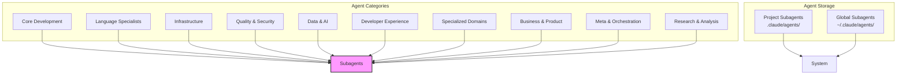
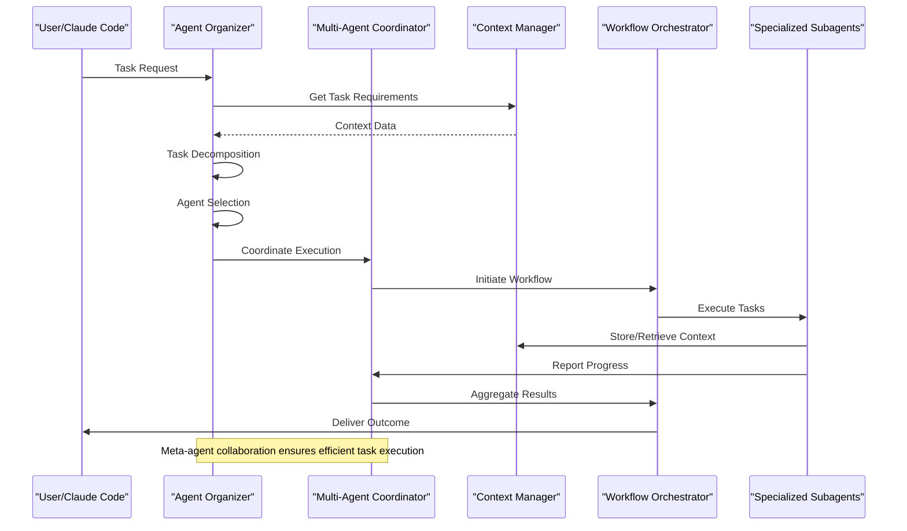

# Technical Architecture

<cite>
**Referenced Files in This Document**   
- [multi-agent-coordinator.md](file://multi-agent-coordinator.md)
- [context-manager.md](file://context-manager.md)
- [workflow-orchestrator.md](file://workflow-orchestrator.md)
- [agent-organizer.md](file://agent-organizer.md)
- [mcp-developer.md](file://mcp-developer.md)
</cite>

## Table of Contents
1. [Introduction](#introduction)
2. [Component-Based Architecture](#component-based-architecture)
3. [Core Architectural Patterns](#core-architectural-patterns)
4. [Meta-Agent Roles and Collaboration](#meta-agent-roles-and-collaboration)
5. [System Boundaries and Data Flows](#system-boundaries-and-data-flows)
6. [Configuration Strategy](#configuration-strategy)
7. [Scalability and Performance](#scalability-and-performance)
8. [Technology Stack and Extensibility](#technology-stack-and-extensibility)

## Introduction

The agents system represents a sophisticated multi-agent architecture designed to enable specialized AI subagents to collaborate effectively on complex development tasks. Each subagent functions as a self-contained unit with domain-specific expertise, operating within an isolated context while contributing to larger workflows through standardized communication protocols. This architecture leverages the Model Context Protocol (MCP) for tool integration and maintains system coherence through meta-agents that coordinate activities, manage shared context, and orchestrate workflows. The design emphasizes specialization, modularity, and seamless collaboration across diverse technical domains.

## Component-Based Architecture

The system follows a component-based architecture where each subagent operates as an independent, specialized unit. Subagents are organized by domain expertise into categories such as core development, language specialists, infrastructure, quality & security, data & AI, developer experience, specialized domains, business & product, meta & orchestration, and research & analysis. Each subagent maintains its own context window, preventing cross-contamination between tasks while allowing focused expertise application. The architecture supports both project-specific agents (stored in `.claude/agents/`) and global agents (stored in `~/.claude/agents/`), with project-level agents taking precedence in case of naming conflicts.

**Diagram sources**
- [README.md](file://README.md#L100-L350)

**Section sources**
- [README.md](file://README.md#L0-L350)

## Core Architectural Patterns

### Specialization
Each subagent embodies the principle of specialization, focusing on a specific domain such as frontend development, database optimization, or security auditing. This allows for deep expertise in particular areas, resulting in higher quality outputs compared to general-purpose agents. The specialization pattern ensures that when a task requires specific knowledge, the most qualified agent can be engaged, either automatically by the system or explicitly by the user.

### Standardized Interfaces
All subagents follow a standardized template structure with consistent sections including name, description, tools, role definition, MCP tool integration, communication protocol, and implementation workflow. This uniform interface enables predictable interactions between agents and simplifies the process of creating, modifying, and maintaining subagents. The standardized YAML front matter provides machine-readable metadata that facilitates agent discovery and selection.

### Tool Integration via MCP
The Model Context Protocol (MCP) serves as the foundation for tool integration, enabling subagents to interact with external systems and data sources. MCP implementations follow JSON-RPC 2.0 specifications and include schema validation, authentication flows, and comprehensive error handling. The protocol supports various transport mechanisms and emphasizes security, performance, and developer experience in its design.

### Context-Aware Communication
Subagents communicate through context-aware protocols that include structured JSON queries to gather necessary information before task execution. Each meta-agent initiates interactions by querying the context manager for relevant information about workflow requirements, agent states, or process needs. This ensures that agents operate with complete situational awareness and can make informed decisions about coordination strategies.

**Section sources**
- [multi-agent-coordinator.md](file://multi-agent-coordinator.md#L0-L292)
- [context-manager.md](file://context-manager.md#L0-L292)
- [workflow-orchestrator.md](file://workflow-orchestrator.md#L0-L292)
- [mcp-developer.md](file://mcp-developer.md#L0-L292)

## Meta-Agent Roles and Collaboration

### Multi-Agent Coordinator
The multi-agent-coordinator specializes in complex workflow orchestration, inter-agent communication, and distributed system coordination. It manages parallel execution, dependency resolution, and fault tolerance across large agent teams. With tools including message queues, pubsub systems, and workflow engines, this meta-agent ensures efficient task distribution and maintains coordination overhead below 5% even at scale.

**Section sources**
- [multi-agent-coordinator.md](file://multi-agent-coordinator.md#L0-L292)

### Context Manager
The context-manager handles information storage, retrieval, and synchronization across the multi-agent system. Utilizing Redis, Elasticsearch, and vector databases, it maintains data consistency while achieving sub-100ms retrieval times. The context manager ensures version tracking, access control, and privacy compliance while supporting various data types from project metadata to error patterns and knowledge bases.

**Section sources**
- [context-manager.md](file://context-manager.md#L0-L292)

### Workflow Orchestrator
The workflow-orchestrator designs and executes complex business processes using state machines and BPMN modeling. It implements transaction management through saga patterns, handles error compensation, and provides comprehensive monitoring and observability. With a focus on reliability (>99.9% workflow reliability), this meta-agent manages hundreds of active workflows simultaneously while maintaining strict state consistency.

**Section sources**
- [workflow-orchestrator.md](file://workflow-orchestrator.md#L0-L292)

### Agent Organizer
The agent-organizer assembles optimal agent teams by analyzing task requirements and matching them with available agent capabilities. Using an agent registry and task queue system, it achieves >95% agent selection accuracy while optimizing resource utilization. The organizer decomposes complex tasks, maps dependencies, and establishes efficient communication patterns among team members.

**Section sources**
- [agent-organizer.md](file://agent-organizer.md#L0-L292)

## System Boundaries and Data Flows

The agents system operates within clearly defined boundaries that separate agent logic from execution environment and external integrations. Data flows follow a structured pattern where requests are received, context is retrieved, appropriate agents are selected, tasks are executed, results are coordinated, and outcomes are delivered.

**Diagram sources**
- [agent-organizer.md](file://agent-organizer.md#L0-L292)
- [multi-agent-coordinator.md](file://multi-agent-coordinator.md#L0-L292)
- [context-manager.md](file://context-manager.md#L0-L292)
- [workflow-orchestrator.md](file://workflow-orchestrator.md#L0-L292)

**Section sources**
- [agent-organizer.md](file://agent-organizer.md#L0-L292)
- [multi-agent-coordinator.md](file://multi-agent-coordinator.md#L0-L292)
- [context-manager.md](file://context-manager.md#L0-L292)
- [workflow-orchestrator.md](file://workflow-orchestrator.md#L0-L292)

## Configuration Strategy

The system uses markdown files with embedded YAML front matter for subagent configuration. This approach combines human-readable documentation with machine-parsable metadata in a single file. The YAML section contains structured data including name, description, and tool integrations, while the markdown body provides detailed role definitions, communication protocols, and implementation workflows.

This configuration strategy offers several advantages:
- **Version Control Friendly**: Markdown files work seamlessly with Git, enabling tracking of changes, branching, and collaborative editing
- **Easy Sharing**: Files can be easily shared across teams and projects through repositories
- **Documentation Integration**: Configuration and documentation coexist, reducing knowledge silos
- **Editor Support**: Widely supported by text editors and IDEs with syntax highlighting
- **Community Contribution**: Low barrier to entry for improvements and new subagent creation

The dual storage system (project-level and global) allows for both standardized enterprise patterns and project-specific customizations, with clear precedence rules resolving any conflicts.

**Section sources**
- [README.md](file://README.md#L0-L350)

## Scalability and Performance

The architecture is designed to scale to 100+ agents while maintaining high performance and reliability. Key scalability considerations include:

- **Horizontal Scaling**: Agent teams can be expanded by adding more specialized subagents without rearchitecting the system
- **Load Distribution**: The agent-organizer and task-distributor meta-agents ensure balanced workloads across available agents
- **Efficient Communication**: Message queues, pubsub systems, and optimized protocols minimize coordination overhead
- **Caching Strategies**: Context manager implements multi-layer caching with Redis to achieve sub-100ms retrieval times
- **Parallel Execution**: Support for map-reduce, scatter-gather, and pipeline patterns enables concurrent processing

Performance implications of agent coordination are carefully managed:
- Coordination overhead is maintained below 5% through efficient messaging and batching
- Deadlock prevention is ensured through rigorous dependency analysis and resource locking strategies
- Fault tolerance includes circuit breakers, retry mechanisms, and automated recovery procedures
- Monitoring provides real-time metrics on agent performance, message throughput, and workflow completion rates

The system demonstrates proven scalability, with the multi-agent-coordinator capable of managing 87+ agents processing 234K messages per minute, and the workflow-orchestrator handling 234 active workflows at 1.2K executions per minute.

**Section sources**
- [multi-agent-coordinator.md](file://multi-agent-coordinator.md#L0-L292)
- [workflow-orchestrator.md](file://workflow-orchestrator.md#L0-L292)
- [context-manager.md](file://context-manager.md#L0-L292)
- [agent-organizer.md](file://agent-organizer.md#L0-L292)

## Technology Stack and Extensibility

The agents system leverages a technology stack centered around the Model Context Protocol (MCP) for integration. Key components include:

- **MCP Tools**: JSON-RPC 2.0 implementation with schema validation (Zod for TypeScript, Pydantic for Python)
- **Storage Systems**: Redis for in-memory data, Elasticsearch for full-text search, vector databases for embeddings
- **Workflow Engines**: BPMN-compliant engines for process modeling and execution
- **Communication**: Message queues, pubsub systems, and WebSocket connections for real-time coordination
- **Development Tools**: Support for multiple languages including TypeScript, Python, Node.js, and various framework-specific tools

Future extensibility paths include:
- **Enhanced AI Integration**: Deeper LLM integration for dynamic agent creation and adaptation
- **Automated Learning**: Systems that capture successful patterns and automatically generate new subagents
- **Cross-Platform Interoperability**: Standardized interfaces for integrating with other agent frameworks
- **Advanced Analytics**: Process mining and optimization recommendations based on execution history
- **Self-Optimization**: Agents that monitor their own performance and suggest improvements

The modular design ensures that new capabilities can be added without disrupting existing functionality, and the open-source nature of the VoltAgent community encourages continuous innovation and improvement.

**Section sources**
- [mcp-developer.md](file://mcp-developer.md#L0-L292)
- [multi-agent-coordinator.md](file://multi-agent-coordinator.md#L0-L292)
- [context-manager.md](file://context-manager.md#L0-L292)
- [workflow-orchestrator.md](file://workflow-orchestrator.md#L0-L292)